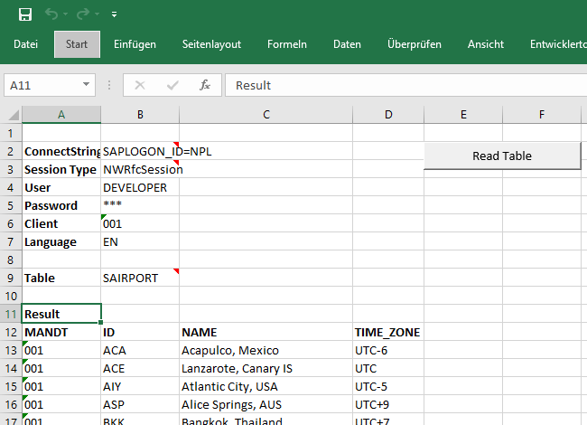

# Rfc Connector Excel (VBA) examples

Note: You need to allow macros in Excel to use these examples.

## Rfc Client

[`RfcClient.xlsm`](https://gitcdn.link/repo/rfcconnector/example-vba/master/RfcClient.xlsm) demonstrates how to call SAP BAPIs or Function Modules from Excel.

## Table Reader

[`TableReader.xlsm`](https://gitcdn.link/repo/rfcconnector/example-vba/master/TableReader.xlsm) demonstrates how to read SAP tables (user must have appropriate permissions on SAP side for that).

For more information, please visit https://rfcconnector.com/